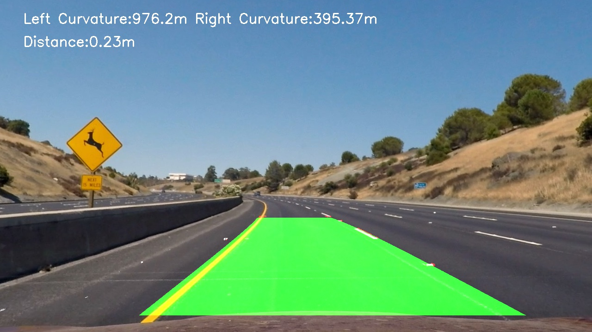
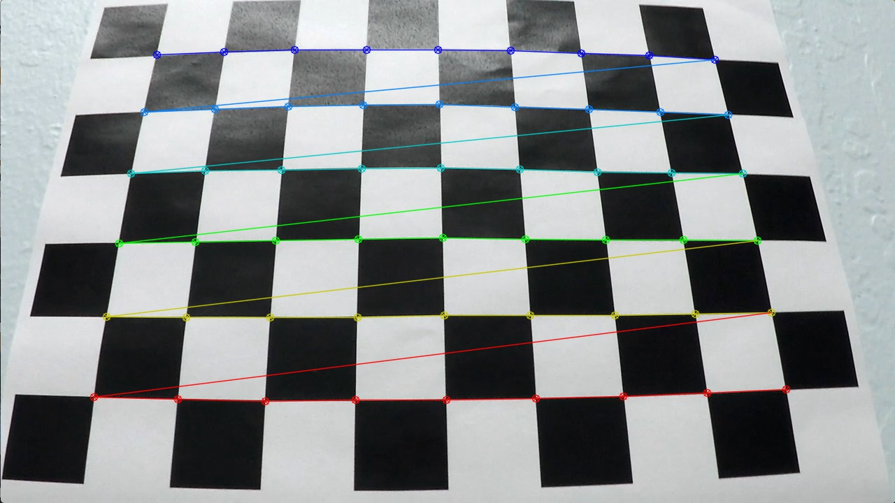
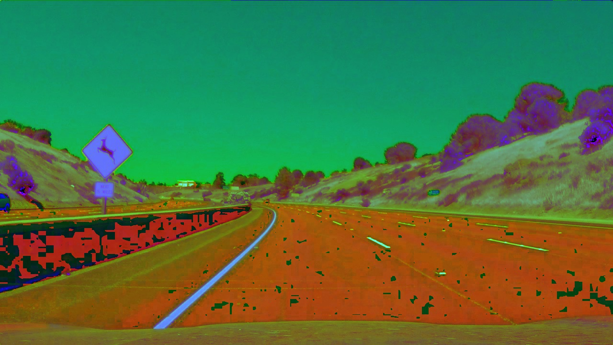
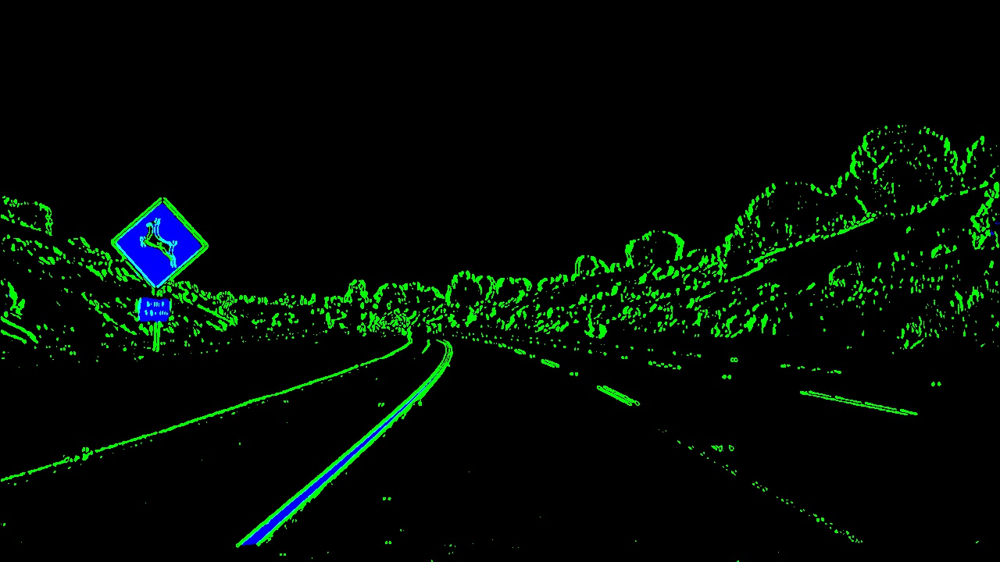
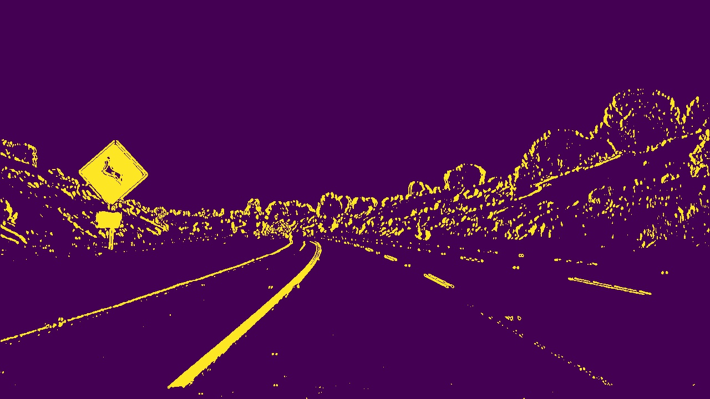
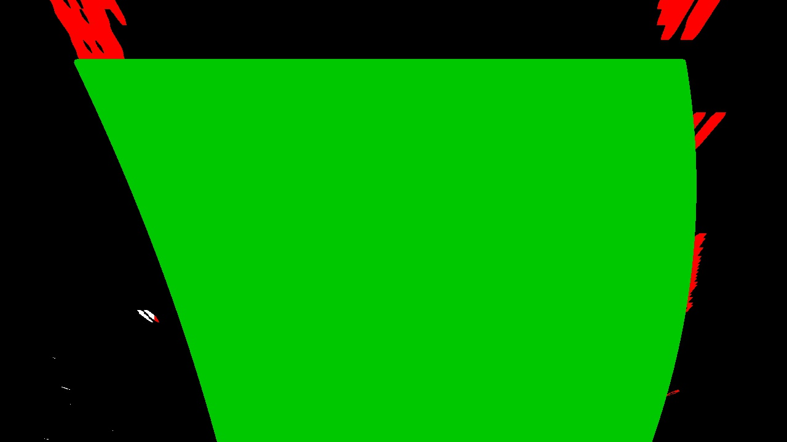
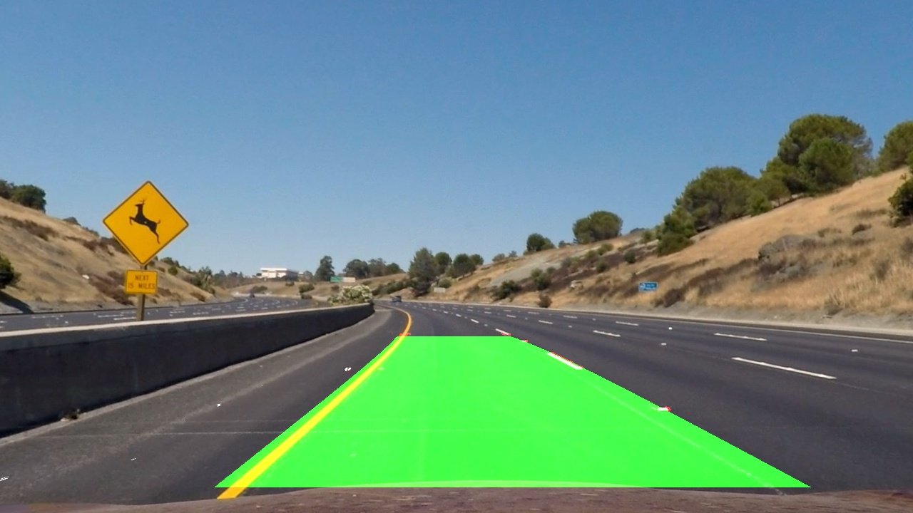

## Advanced Lane Finding

In this project, your goal is to write a software pipeline to identify the lane boundaries in a video, but the main output or product we want you to create is a detailed writeup of the project.  Check out the [writeup template](https://github.com/udacity/CarND-Advanced-Lane-Lines/blob/master/writeup_template.md) for this project and use it as a starting point for creating your own writeup.  

Creating a great writeup:
---
A great writeup should include the rubric points as well as your description of how you addressed each point.  You should include a detailed description of the code used in each step (with line-number references and code snippets where necessary), and links to other supporting documents or external references.  You should include images in your writeup to demonstrate how your code works with examples.  

All that said, please be concise!  We're not looking for you to write a book here, just a brief description of how you passed each rubric point, and references to the relevant code :). 

You're not required to use markdown for your writeup.  If you use another method please just submit a pdf of your writeup.

The Project
---

The goals / steps of this project are the following:

* Compute the camera calibration matrix and distortion coefficients given a set of chessboard images.
* Apply a distortion correction to raw images.
* Use color transforms, gradients, etc., to create a thresholded binary image.
* Apply a perspective transform to rectify binary image ("birds-eye view").
* Detect lane pixels and fit to find the lane boundary.
* Determine the curvature of the lane and vehicle position with respect to center.
* Warp the detected lane boundaries back onto the original image.
* Output visual display of the lane boundaries and numerical estimation of lane curvature and vehicle position.

The images for camera calibration are stored in the folder called `camera_cal`.  The images in `test_images` are for testing your pipeline on single frames.  If you want to extract more test images from the videos, you can simply use an image writing method like `cv2.imwrite()`, i.e., you can read the video in frame by frame as usual, and for frames you want to save for later you can write to an image file.  

Pipeline
---
Camera calibration using chessboard images
---

Camera calibration is done using set of chessboard images in camera_cal folder. Corners are found using findChessboardCorners(). mtx and dist points are calculated from calibrateCamers() function

|Original Image|Calibrated Image|
|--------------|----------------|
|||

Apply color transforms, sobel..etc., to create a thresholdedbinary image
---

Apply both gray scale and HLS scale, it can be seen from the images that yellow line are more visible in HLS scale.

Combined threshold is developed by applying sobel operator on both the gray scale image and hls scale image
|Color binary image|Combined binary image|
|--------------|----------------|
|||

Apply perspective transform on combined binary image
---
getPerspectiveTransform() is applied to get the birds eye view of a given region of intrest

Draw lane lines on warped image
---
Using the above warped image get the lane lines using max histogram values on btoh sides. Then fit a second order polynomial line for both sides.

Apply inverse perspective and draw lane lines on original image
---
Apply inverse perspective transform on the weighted warped image  and add it to the original image

Calculate radius and distance from centre
---
As per standards, lane length is assumed to be 3.7m. Distance from centre is calculated by using difference bewtween the centre of image width and nearest left and right points of the image. The difference is multiplied by the 3.7/700.

Shortcomings
---
Although this method is able to detect lane lines in curves, its till not able to track the lane lines in brightened images as seen in challenge_video and harder_challenge_videos. It will also fail where the lane lines are broken 
